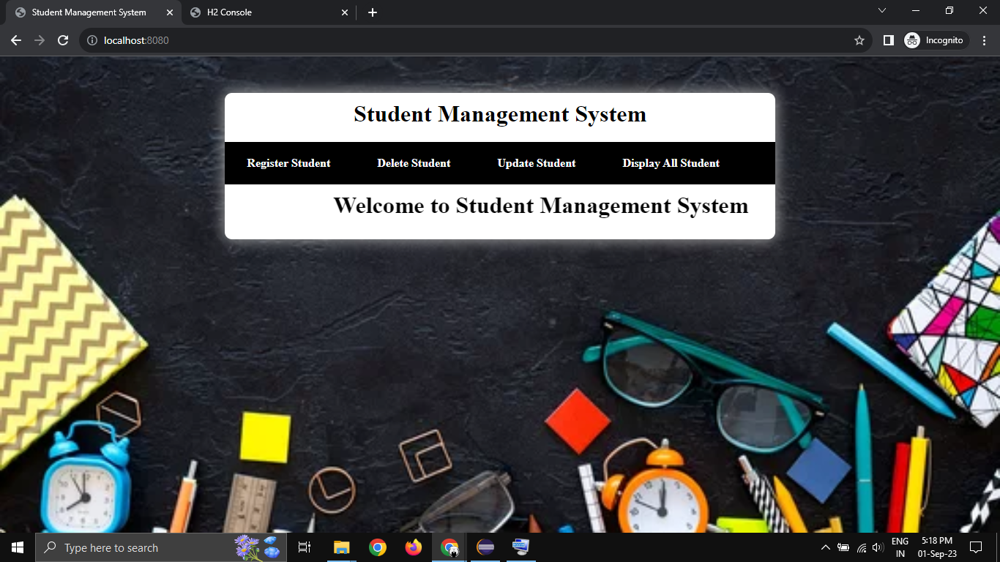
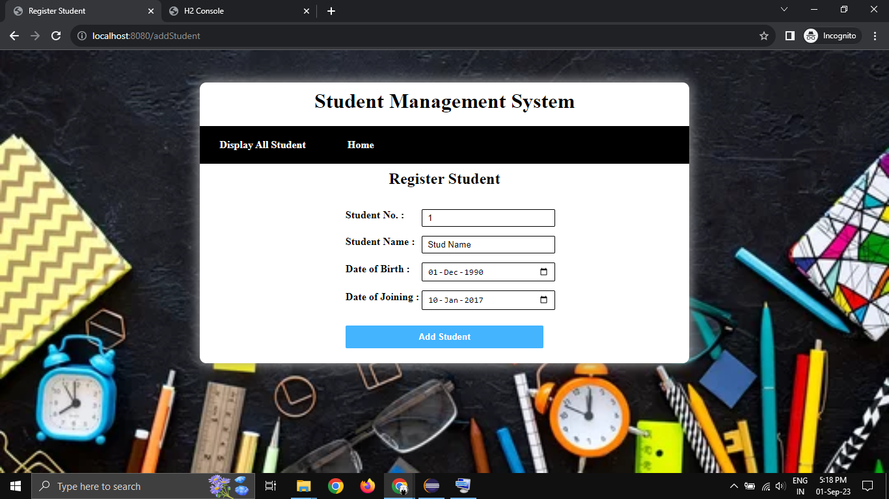
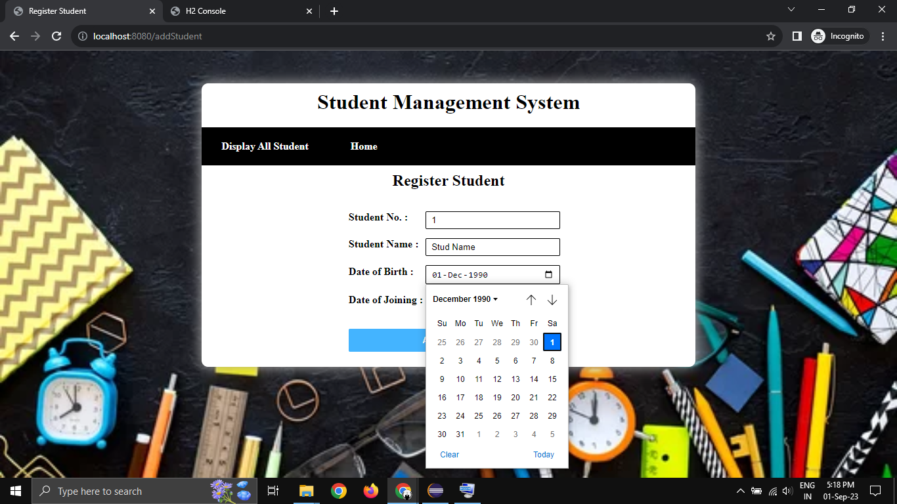
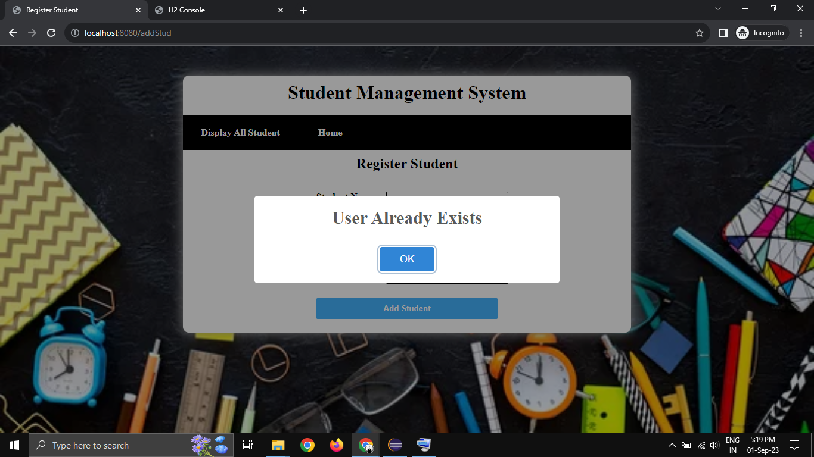
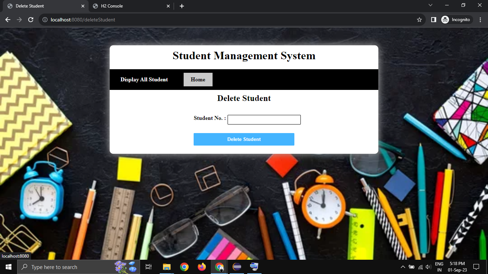
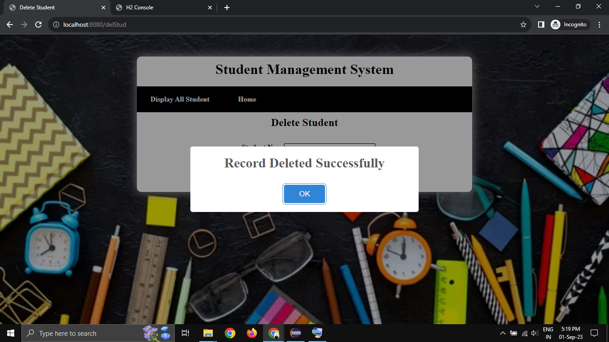
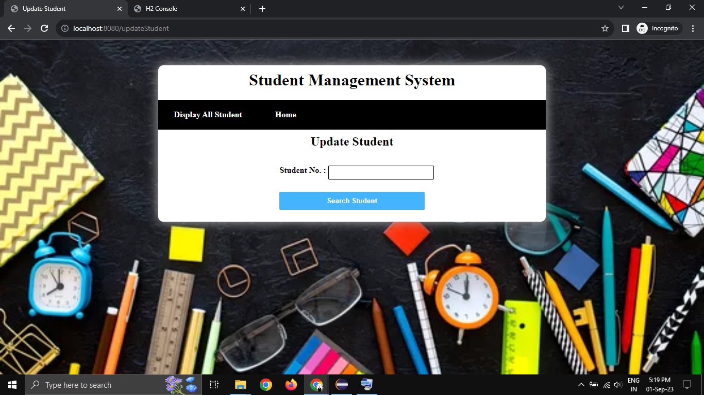
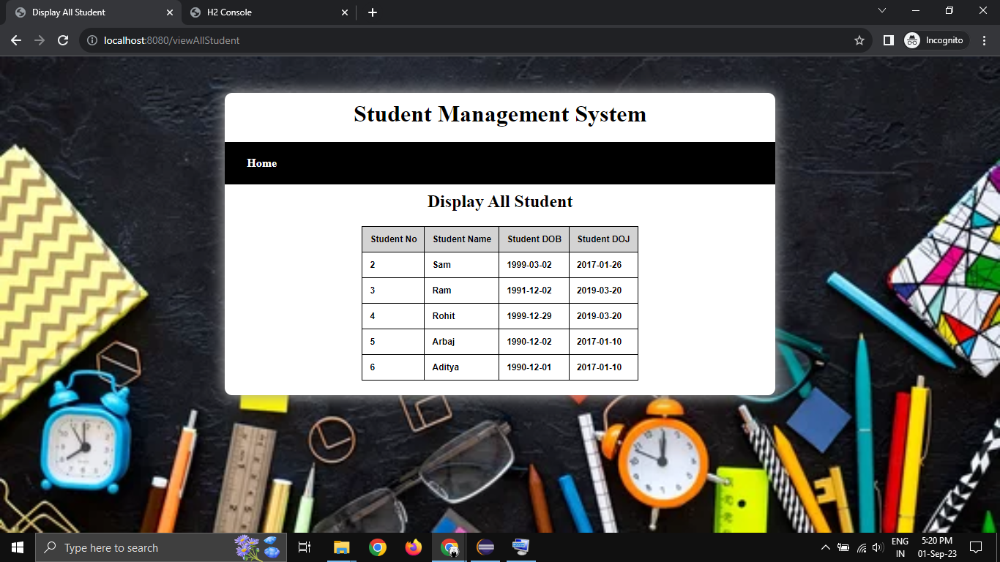
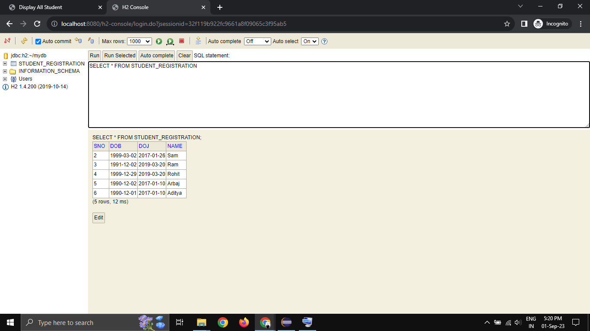
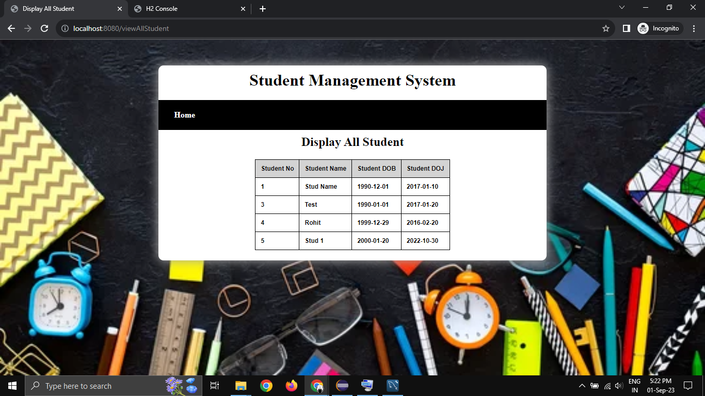

# Student Management System
Student Management System Using Spring Boot and Mysql & H2 Database (CRUD-Operation)


## Features
- CRUD Operation (Create,Read,Update and Delete)
- Running on Two Database (MySQL & H2 Database)
- Sweetalerts Dialog Box
- Spring Boot Crud Repository
- Easy to Understand Code

## Installation
- Just, Clone this repository - 
````bash 
git clone https://github.com/SLoharkar/Student-Management-System.git
````
- Run File Using Any Java Application Like Eclipse IDE For Java Developer or Visual Studio Code


## Website Trailer

https://github.com/SLoharkar/Student-Management-System/assets/68845746/8b4cff7c-8f9f-4e4b-a248-4e1d68b88557


https://github.com/SLoharkar/Student-Management-System/assets/68845746/983feea9-78bc-485f-8824-020683a0a072


## Website Highlights
<p align="left" width="100%">

  
  






















</p>


## Dependencies
- `Eclipse-IDE For Java Developer`
- `jdk-1.8`
- `Spring Boot Version 2.2.6.RELEASE`
- `Windows OS`
